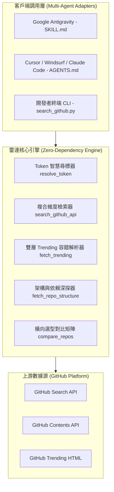

# 🛠️ 業界開發筆記：從零打造開源專案雷達（GitHub Project Radar）的架構演進與工程實踐

> **文檔標籤**：`系統架構` `API工程` `AI Agent生態` `跨平台相容性` `開源選型評估`  
> **作者**：GitHub Project Radar 開發團隊  
> **適用讀者**：技術架構師、開源專案維護者、AI Coding Agent 重度使用者、全端工程師

---

## 📌 摘要 (Executive Summary)

在大型語言模型 (LLM) 與 AI 代理 (AI Agent) 爆發式增長的時代，開源生態正經歷前所未有的「資訊過載」與「包裝泡沫」。每天在 GitHub 上湧現數以千計的新專案，充斥著大量只具備酷炫 README 的概念驗證 (PoC) 或單純的 API Wrapper。工程團隊面臨兩大核心痛點：**「如何及早發現真正有價值的早期黑馬？」** 以及 **「如何在不下載、不本地編譯的前提下，秒速穿透包裝判斷其工程成熟度？」**

本專案 `GitHub Project Radar` 旨在提供一套**零外部依賴、跨 AI 平台相容、工程級深度評估**的開源項目雷達系統。本文將從系統架構選型、關鍵技術難題突破、反過度工程哲學，以及 Windows 跨平台相容性陷阱等維度，完整復盤本專案的工業級實踐。

---

## 🏛️ 一、 系統架構與設計哲學



### 1. 堅持「零外部依賴」(Zero-Dependency) 的取捨與堅持
在 Python 生態中，引入 `requests`、`beautifulsoup4` 或 `pydantic` 是常態做法，但在打造 **AI Agent 工具** 時，外部依賴是致命的摩擦點：
* **痛點**：Agent 在沙盒或使用者本機調用工具時，若缺乏環境隔離或遭遇套件版本衝突，工具會直接掛掉。
* **工程決策**：全腳本純採用 Python 3 標準庫實現：
  * 使用 `urllib.request` 與自定義重試邏輯替代 `requests`。
  * 繼承 `html.parser.HTMLParser` 並輔以正則備援替代 `bs4`。
  * 內建正則分析器解析 `package.json`、`Cargo.toml`、`pyproject.toml`、`requirements.txt`、`go.mod`。
* **收益**：**開箱即用**。任何安裝 Python 3 的環境在 0.1 秒內直接啟動，安裝失敗率降為 0%。

### 2. 借鑒 Ponytail 哲學：「刺破開源項目包裝」
業界評估開源項目常掉入「Stars 崇拜」與「README 盲信」的陷阱。我們制定了工程落地的 **4-Pillar 評估法**，並將其內化為代碼：
1. **痛點與定位 (Problem & Value)**：是否切中現有架構（如 LangChain、vLLM）的盲區？
2. **架構健全度 (Architecture & Health)**：自動探測是否存在 `tests/`、`docs/`、`examples/`、CI/CD。
3. **極簡上手 (Quick Start)**：輸出 1 行淺層克隆指令（`git clone --depth 1`）。
4. **商業授權與維護狀態 (License & Liveness)**：自動偵測是否被封存 (Archived) 或屬於 Fork 分支。

---

## 🔬 二、 關鍵技術挑戰與解決方案

### 1. 檢索彈性升級：從死板參數到動態語法拼裝
#### 挑戰：
傳統 CLI 參數往往將查詢條件寫死，難以應對靈活需求（例如：只想找「最近 7 天有代碼提交」且「星數在 20 到 500 之間」的 MCP 工具）。
#### 解決方案：
實作**高彈性查詢編排器 (Query Composer)**：
```python
# 支援自由 Query、時間截斷與星數區間複合編排
if "stars:" not in raw_query:
    if args.min_stars is not None and args.max_stars is not None:
        query_parts.append(f"stars:{args.min_stars}..{args.max_stars}")
    elif args.min_stars is not None:
        query_parts.append(f"stars:>={args.min_stars}")

if args.pushed_days is not None and args.pushed_days > 0 and "pushed:" not in raw_query:
    push_cutoff = (datetime.datetime.now() - datetime.timedelta(days=args.pushed_days)).strftime("%Y-%m-%d")
    query_parts.append(f"pushed:>{push_cutoff}")
```
* **效果**：既保留 `-q / --query` 原生語法靈活性，又保留開箱即用的旗標過濾，成功挖掘出不被巨頭霸榜的潛力新星（Hidden Gems）。

---

### 2. 免 Clone 輕量級深探：GitHub Contents API 靜態解析技術
#### 挑戰：
要評估一個 Repo 的代碼架構，常態做法是 `git clone` 後進行靜態分析。但在檢索階段，Clone 動輒幾十 MB 到幾 GB，耗費頻寬與時間，且存在執行不可信代碼的安全風險。
#### 解決方案：
利用 GitHub REST API 的單次 Contents 端點取得頂層目錄結構，並以「單點穿透」方式提取配置檔案：
1. **結構快篩**：1 次 API 請求取得根目錄節點，比對是否有測試目錄 (`tests/`)、文檔目錄 (`docs/`)、範例目錄 (`examples/`) 與自動化 CI/CD (`.github/workflows`)。
2. **依賴萃取**：識別頂層構建檔案（如 `package.json` 或 `Cargo.toml`），以 Base64 輕量抓取並解析核心套件名稱。
* **效果**：在不到 0.8 秒、耗費不到 20KB 流量的條件下，Agent 就能看透該專案是「真材實料的工程實現」還是「空有 README 的空殼專案」。

---

### 3. 多源 Token 智慧尋標與限流防禦機制
#### 挑戰：
GitHub 匿名 Search API 每分鐘僅允許 10 次請求，而開發者配置環境變數的意願低且容易遇到跨環境失效。
#### 解決方案：
實作四級權限降級搜尋 (`resolve_token`)：
$$\text{CLI (--token)} \longrightarrow \text{ENV (GITHUB\_TOKEN)} \longrightarrow \text{本地 .env 檔} \longrightarrow \text{使用者家目錄配置 (~/.github\_radar\_token)}$$
同時在捕獲 HTTP 403 / 429 時，主動解析響應頭中的 `x-ratelimit-reset`：
```python
reset_dt = datetime.datetime.fromtimestamp(int(reset_epoch))
diff_sec = max(0, int((reset_dt - now).total_seconds()))
# 給予精確重置秒數與降級指引
```

---

### 4. Windows 終端編碼（CP950 / UTF-8）深坑踩踏與復盤
#### 踩坑實錄：
在 Windows 繁體中文環境下，終端預設代碼頁為 CP950（Big5）。當 Python 輸出含有現代 Emoji（🚀, ⭐, 📁）或 `cmd.exe` 解析包含非 ASCII 字元與特殊符號（`&`, `:`, `(`）的 `.bat` 檔時，會引發兩大嚴重崩潰：
1. **Python `UnicodeEncodeError`**：
   * **修復**：啟動前檢查 Windows 平台，主動重置標準輸出與錯誤流為 `utf-8` 並設定容錯模式 `errors="replace"`：
     ```python
     if sys.platform.startswith("win") and hasattr(sys.stdout, "reconfigure"):
         sys.stdout.reconfigure(encoding="utf-8", errors="replace")
     ```
2. **Batch 腳本符號誤解析**：
   * 在 `.bat` 檔中，註解字元 `::` 在特定代碼頁與代碼塊中會造成語法解析錯亂；此外，Commit 訊息中的 `&` 會被 CMD 視為管線運算子，導致 `'multi-agent' is not recognized` 報錯。
   * **架構優化**：徹底摒棄複雜的 Batch 邏輯，將 `.bat` 降級為純粹的 3 行啟動器，內部全面交由支援原生 UTF-8 與現代物件管線的 **PowerShell 7/5.1** 執行：
     ```bat
     @echo off
     powershell -NoProfile -ExecutionPolicy Bypass -File "%~dp0scripts\push_github.ps1"
     pause
     ```

---

## 📊 三、 核心商業與工程價值

| 指標維度 | 傳統人工作法 | GitHub Project Radar 效益 |
| :--- | :--- | :--- |
| **新技術調研週期** | 耗時 2 ~ 4 小時翻閱網頁與 Issue | **30 秒** 內完成跨主題探索與雷達輸出 |
| **競品技術選型對比** | 手動建立 Excel/Doc 整理星星與依賴 | **1 行指令** (`--compare`) 自動生成多維度矩陣 |
| **工程成熟度判斷** | 需手動 Clone 閱讀代碼判斷有無測試 | **自動健全度 Checklist**，一眼看穿 PoC 還是商用 |
| **AI Agent 跨工具適配** | 各 Agent 規則格式各自為政 | 通用 `SKILL.md` + `AGENTS.md`，一套規則相容所有助手 |

---

## 🔮 四、 復盤總結與未來演進路線 (Roadmap)

1. **反過度工程的勝利**：
   在開發過程中，我們多次評估是否引入本地向量庫（ChromaDB）或 SQLite 快取。最終依循奧坎剃刀原則（Occam's razor）：**保持無狀態、免編譯、純文字傳遞，才是 CLI 與 Agent Skill 最強大、最持久的生命力來源**。
2. **未來規劃**：
   * [ ] **多源趨勢聚合**：擴充 Hacker News (Show HN) 與 Trendshift.io API 作為 GitHub Trending 的第二備援源。
   * [ ] **語意層級摘要 (LLM Diff Peek)**：在 `--info` 中自動對最新 Release 的 Changelog 進行語意萃取。
   * [ ] **授權相容性安全診斷**：自動比對目標專案的開源 License 是否與使用者現有專案相容。

---

> **結語**：技術工具的價值不在於代碼有多複雜，而在於能否在最少的依賴與摩擦下，精準解決實際工作流中的核心痛點。`GitHub Project Radar` 證明了標準庫與乾淨架構所能達到的工程高度。
