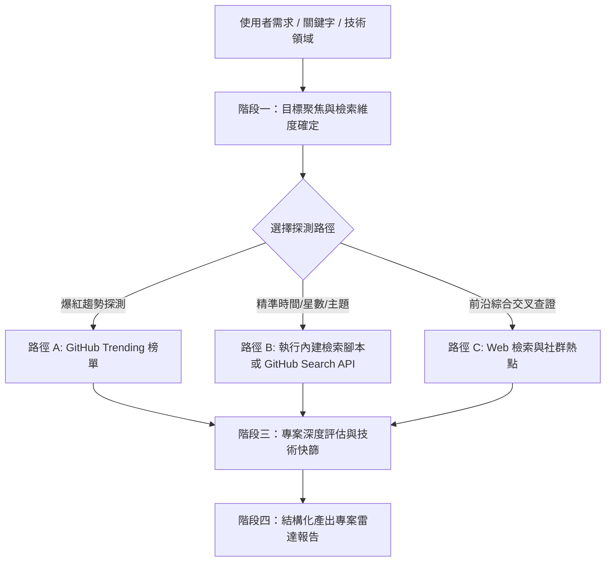

# 🚀 GitHub Project Radar (開源專案雷達與最新項目探測器)

本技能提供一套標準化流程與工具，專門用來在 GitHub 上精準探測**最新發布**、**成長激增**、**技術前沿**的優質開源專案，並提供結構化、可落地的技術評估報告。

---

## 📌 核心工作流程全景圖



---

## 階段一：目標聚焦與維度設定 (Target & Filter Definition)

接到查找請求時，快速確認或預設以下四個維度：

1. **技術主題 (Topic / Domain)**：
   * 例如：AI Agent、LLM 微調/量化、RAG 向量檢索、MCP (Model Context Protocol) 工具、Rust 高效能 CLI、Next.js 全端架構、自託管 (Self-hosted) 等。
2. **時效區間 (Time Window)**：
   * **超新星 (Newborn)**：近 7 ~ 30 天內新建（`created:>YYYY-MM-DD`）。
   * **活躍維護 (Active)**：近 7 天內有代碼提交（`pushed:>YYYY-MM-DD`）。
   * **即時熱門 (Trending)**：今日 (Daily) 或本週 (Weekly) 飆升榜。
3. **程式語言偏好 (Language)**：
   * Python / TypeScript / Rust / Go / C++ 等（留空則涵蓋全語言）。
4. **星數門檻 (Stars Threshold)**：
   * 起步潛力股：`10 ~ 200 stars`
   * 爆款新星：`500 ~ 3000+ stars`

---

## 階段二：雙軌高效探測路徑 (Dual-Track Search Strategy)

### 路徑 A：執行內建輔助腳本 (Zero-Dependency Python Script)

本技能自帶專屬 Python 探測腳本 [search_github.py](./scripts/search_github.py)，免額外安裝任何套件。

#### 1. 探測指定領域最新發布或活躍專案
```bash
# 探索近 14 天內創建、Stars 介於 20~500 的潛力新星（排除老牌大項目）
python ./scripts/search_github.py --topic "agent,llm" --days 14 --min-stars 20 --max-stars 500 --limit 10

# 探索近 7 天內有代碼推送 (pushed)、自訂進階查詢語法的 MCP 項目
python ./scripts/search_github.py -q "mcp server" --pushed-days 7 --min-stars 30 --limit 10
```

#### 2. 爬取 GitHub 今日或本週熱門趨勢榜 (GitHub Trending)
```bash
# 查詢全語言今日趨勢
python ./scripts/search_github.py --mode trending --since daily --limit 10

# 查詢 Python 本週趨勢
python ./scripts/search_github.py --mode trending --language python --since weekly --limit 10
```

#### 3. 單一專案深度透視（目錄樹、工程健全度檢測、依賴項與 README 摘錄）
```bash
# 一鍵透視代碼結構、測試/文件健全度、核心技術棧與 README
python ./scripts/search_github.py --info "DietrichGebert/ponytail"
```

#### 4. 多專案橫向對比矩陣（技術選型與架構橫向評估）
```bash
# 自動抓取多個專案並生成對比表格（星數、更新率、測試、文件、依賴）
python ./scripts/search_github.py --compare "crewAIInc/crewAI,run-llama/llama_index"
```

#### 5. 一鍵匯出調研報告至檔案（支援 Markdown 與 JSON）
```bash
# 將對比矩陣或搜尋結果直接存檔
python ./scripts/search_github.py --compare "fastapi/fastapi,tiangolo/sqlmodel" -o comparison_report.md
python ./scripts/search_github.py -q "mcp server" --limit 10 -o mcp_radar.md
```

> **提示**：腳本內建 Windows UTF-8 自動保護、GitHub API 限流診斷，以及 Token 自動尋標機制（自動讀取 `.env` 內的 `GITHUB_TOKEN`、系統環境變數或 `~/.github_radar_token`）。若 Trending 頁面連線受阻，腳本會自動切換為活躍專案備援搜尋。
> 路徑說明：若已安裝至全域技能目錄，亦可使用 `python %USERPROFILE%/.gemini/config/skills/github-project-radar/scripts/search_github.py ...`。

*(詳細搜尋語法請查閱參考指南：[search_syntax_cheatsheet.md](./references/search_syntax_cheatsheet.md))*

---

### 路徑 B：藉助 Web 搜索工具交叉驗證 (Search & Read Tools)

當無法直接存取終端機或需要社群口碑交叉對照時，使用 `search_web` 與 `read_url_content`：
* 搜尋指令範例：`site:github.com "topic:llm" created:>2026-03-01 stars:>50`
* 查詢前沿聚合站：`trending github repositories ai agent this week site:github.com OR site:news.ycombinator.com`

---

## 階段三：四維度專案深度快篩 (4-Pillar Evaluation Framework)

找到專案後，不要僅僅給出星星數和單句描述，應為使用者進行專業的工程評估：

1. **核心定位與痛點解決 (Problem & Value)**：
   * 解決了什麼現有開源方案（如 LangChain, vLLM, AutoGen 等）未能滿足的痛點？
2. **技術架構與亮點 (Architecture & Highlights)**：
   * 底層核心依賴（例：FastAPI、PyTorch、Tokio、WebAssembly）。
   * 設計架構特色（模組化、輕量無依賴、極致低延遲、Local-First 等）。
3. **快速試用與驗證 (Quick Start)**：
   * 提煉 1~3 行最關鍵的安裝與啟動指令（`git clone`, `uv run`, `docker compose up`）。
4. **現狀與潛在風險評估 (Maturity & Caveats)**：
   * 是否為玩具/概念驗證 (PoC) 或具備生產就緒潛力 (Production Ready)？
   * 開源協議 (MIT, Apache-2.0, AGPL, CC) 與商業友善度。

---

## 階段四：標準化輸出範本 (Standard Output Template)

回覆給使用者時，採用清晰專業的雙層結構：

### 1. 總覽雷達表 (Overview Radar Table)
```markdown
| 專案名稱 | 主語言 | 🌟 Stars (趨勢) | 核心定位與關鍵特色 | 連結 |
| :--- | :--- | :--- | :--- | :--- |
| **owner/repo1** | `Python` | 1,240 (🚀 +320 today) | 超輕量多代理協同框架，零依賴且相容 OpenAI API | [Repo](https://github.com/...) |
| **owner/repo2** | `Rust`   | 890 (🌱 新建 5 天)   | 高效能在地向量檢索 CLI，支援 GPU 加速 | [Repo](https://github.com/...) |
```

### 2. 焦點專案深度剖析卡片 (Spotlight Deep-Dives)
為 2~3 個最值得關注的亮點專案提供卡片：
* **🔥 專案名 (Owner/Repo)**：超連結與一句話結論
* **💡 解決的痛點**：解決什麼具體問題
* **🛠️ 技術棧與亮點**：技術細節
* **⚡ 快速上手**：簡明指令
* **⚖️ 評估與建議**：適合誰用、注意事項

---

## 🚀 最佳實踐準則 (Best Practices)
1. **拒絕陳舊資訊**：優先聚焦最近發布或最近有持續活躍維護的項目，標明時間節點。
2. **客觀務實**：明確區分「概念性熱潮 (Hype)」與「具備實用架構的真材實料專案」。
3. **可落地性**：隨專案附上簡潔的嘗試方式，幫助使用者隨時 clone 下來動手實踐。
