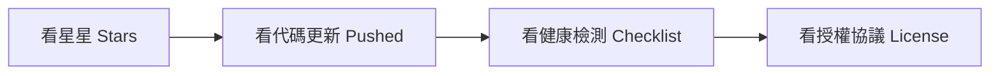

# 🧭 GitHub Project Radar — 小白超新手使用指南

> **這是一篇寫給「完全不懂寫程式、沒碰過命令列」的朋友的使用說明書。**  
> 只要你會打字跟 AI 聊天，就能在 3 分鐘內學會如何用它淘到全世界最新、最酷的開源寶藏！

---

## 🌟 一、這是什麼神器？（30 秒看懂）

想像一下：**GitHub** 是全世界工程師免費分享軟體的「全球超級大超市」，裡面放了幾億個工具、外掛、AI 機器人和軟體，全都**免費開源**。

但問題是：
1. 東西太多，你根本不知道哪個好用、哪個已經沒人維護。
2. 很多專案只是作者隨手寫的概念（PPT 專案），下載下來根本跑不動。

**「GitHub Project Radar」就是你的 AI 專屬探測雷達與技術顧問**：
* 幫你掃描**最近幾天剛剛爆紅**的新工具。
* 幫你過濾掉沒人維護的「殭屍專案」。
* 像資深工程師一樣，幫你檢查這個工具**「安不安全、有沒有寫說明書、能不能商業使用」**。

---

## 🚀 二、怎麼開始用？（兩種最簡單的方式）

### 方式 A（最推薦！）：不用懂指令，直接跟 AI「說人話」

只要這個技能已經安裝在你的 AI 助理（如 Antigravity）中，你只要在聊天視窗裡像跟真人聊天一樣發問，AI 就會**自動在背後啟動雷達幫你抓資料**！

#### 💬 聊天常用「召喚咒語」：

* **想找新工具時**：
  > 「幫我找找看最近 14 天內，有沒有最新推出的 AI Agent（智慧代理）開源專案？」
* **想看熱門排行時**：
  > 「今天 GitHub 上全語言最熱門的 Trending 排行榜有哪些？」
* **想找特定領域的免費軟體時**：
  > 「有沒有類似 Notion 但可以自己架設在本地的自託管 (Self-hosted) 筆記軟體？」
* **兩個工具猶豫不決時**：
  > 「幫我比較一下 crewAI 和 llama-index 這兩個專案，哪一個比較受歡迎、維護得更勤勞？」

---

### 方式 B：用滑鼠與終端機直接執行（複製貼上大法）

如果你想自己動手玩玩看，不用寫程式，只要「複製以下文字 $\to$ 貼上終端機 $\to$ 按 Enter」：

#### 步驟 1：打開終端機
* 在鍵盤上按 `Win + R`，輸入 `powershell` 後按 Enter（會跳出一個藍色或黑色的視窗）。
* 切換到本專案目錄。

#### 步驟 2：複製貼上以下任何一行指令：

| 你想達成的目的 | 直接複製這行指令 |
| :--- | :--- |
| **找最近 14 天內剛發布的新 AI 工具** | `python scripts/search_github.py --topic "agent,llm" --days 14 --limit 5` |
| **看今天全世界最熱門的 GitHub 排行榜** | `python scripts/search_github.py --mode trending --limit 5` |
| **深入透視某個專案到底紮不紮實** | `python scripts/search_github.py --info "DietrichGebert/ponytail"` |
| **一次對比兩個工具哪個更好** | `python scripts/search_github.py --compare "crewAIInc/crewAI,run-llama/llama_index"` |
| **把搜尋結果直接存成一份 Markdown 筆記** | `python scripts/search_github.py -q "mcp server" -o 搜尋結果.md` |

---

## 🔍 三、報告怎麼看？小白「防踩雷」4 大法寶

當雷達把專案報告印出來給你看時，請看這 4 個關鍵指標：



1. **🌟 看星星數 (Stars)**：
   * **10 ~ 100 顆星**：剛剛起步的潛力新星（可能是剛發布幾天的好東西）。
   * **500 ~ 5,000 顆星**：社群口碑極佳、正在快速成長的熱門專案。
   * **10,000+ 顆星**：超級老牌巨頭。
2. **📅 看最近推送時間 (Pushed)**：
   * 如果顯示最近 1~3 天前更新 $\to$ ✅ 作者非常活躍。
   * 如果顯示 6 個月或 1 年以前 $\to$ ⚠️ 作者可能棄坑了，不建議選用！
3. **🧪 看工程健全度檢測 (Checklist)**：
   * 雷達會自動幫你檢查是否有 `tests/`（測試程式碼）與 `docs/`（說明書）。
   * 只有 README 卻沒有任何測試或範例的專案，很多只是「概念炒作」，實際不好用。
4. **📜 看授權協議 (License)**：
   * `MIT` 或 `Apache-2.0` $\to$ 最寬鬆，免費商用都沒問題。
   * `GPL` 或 `AGPL` $\to$ 如果要商業使用需注意開源傳染性。

---

## ❓ 四、新手常見問答 (FAQ)

### Q1：畫面出現 `⚠️ 速率限制告警` 怎麼辦？
* **原因**：GitHub 官方為了防止機器人洗版，規定「未登入的使用者每分鐘只能搜尋 10 次」。
* **解決辦法**：
  1. 等 1~2 分鐘再試即可。
  2. 或者在專案目錄下新增一個 `.env` 檔案，填入你的 GitHub 免費 Token（參考專案裡的 `.env.example`），配額就會立刻增加到每分鐘 30 次以上！

### Q2：我看到滿意的工具，該怎麼下載回自己的電腦？
* 雷達在每次詳細探測 (`--info`) 的最後，都會自動附上一行下載代碼：
  ```bash
  git clone --depth 1 https://github.com/作者名稱/專案名稱.git
  ```
* 複製這一行貼到終端機執行，幾秒鐘就能把專案乾淨地下載下來。

### Q3：這套技能需要每次打開都安裝一次嗎？
* **不需要！**
* 技能已經自動安裝在你的全域 AI 設定庫（`~/.gemini/config/skills/github-project-radar`）。
* 以後不管你在任何資料夾開啟 AI 視窗，隨時隨地都能直接召喚它！

---

🎉 **恭喜你！現在你已經具備比 90% 的人更快發現前沿開源技術的超能力了！**
